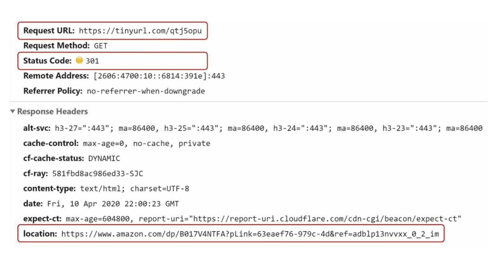
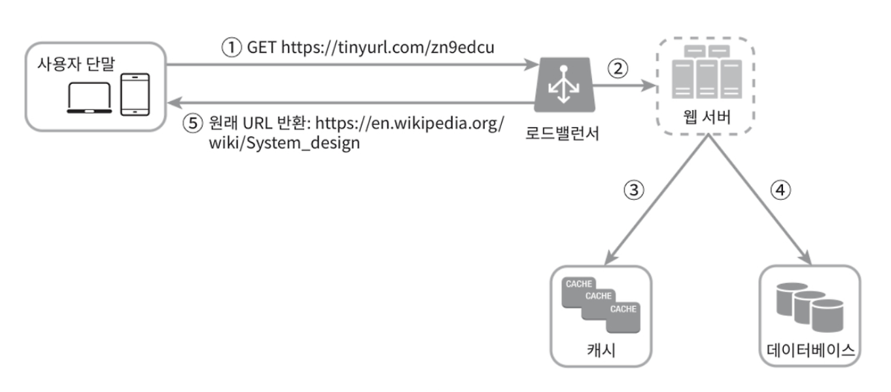

# 8장: URL 단축키 설계
노션 링크 : https://www.notion.so/8-URL-2b6a3c4c42a48064b682cee790301c18?source=copy_link

# 1단계) 문제 이해 및 설계 범위 확정

→ 질문을 통해 모호함을 줄이고 요구사항을 알아내야 한다.

### 파악한 기본적 기능

1. URL 단축: 주어진 긴 URL을 훨씬 짧게 줄인다
2. URL 리디렉션: 축약된 URL로 HTTP 요청이 오면 원래 URL로 안내
3. 높은 가용성과 규모 확장성, 그리고 장애 감내가 요구됨

# 2단계) 개략적 설계안 제시 및 동의 구하기

### API 엔드포인트

클라이언트는 서버가 제공하는 API 엔드포인트를 통해 서버와 통신한다. 엔드포인트는 REST 스타일로 설계할 것이다. URL 단축기는 기본적으로 두 개의 엔드포인트를 필요로 한다.

1. URL 단축용 엔드포인트
2. URL 리디렉션용 엔드포인트

### URL 리디렉션

- 단축 URL을 받은 서버는 301 상태코드를 줄 것임
- 이때, 단축 URL을 원래 URL로 변경 후 응답 헤더의 Location에 넣어서 응답
- 이후 원래 URL로 리디렉션을 하게됨

# 3단계) 상세 설계

## **1) 데이터 모델**

- 단순히 메모리에 저장하는 것은 비효율적이기 때문에 <단축 URL, 원래 URL>의 순서 쌍을 관계형 데이터베이스에 저장해야 한다.

## **2) 해시 함수**

- 해시 함수는 원래 URL을 단축 URL로 변환하는데 쓰인다.
- **해시 값의 길이 :** 단축 URL의 사용 가능 문자가 0~9, a-Z까지 총 62개이고, 총 3650억 개 생성이 가능해야 하기 때문에 62^n이 3650억 개보다 커지는 n을 찾아야 한다. n이 7이면 3.5조 개의 URL을 만들 수 있다. 이로써 해시 값의 길이는 7로 한다.

## **3) 해시 함수 구현**

- **해시 후 충돌 해소 방법**
    - 잘 알려진 해시 함수들(CRC32, MD5, SHA-1)을 통해 먼저 url을 단축한다. 해시 함수 특성상 충돌이 발생할 수 있습니다. 그리고 단축 후 해시 값의 길이가 7을 넘어가면 줄여야 한다. 가장 간단한 방법은 긴 문자를 일단 7개만 사용하는 것으로 해서 DB에 같은 것이 있나 확인한다. 없다면 그대로 7개만 저장, 있다면 임의의 문자 추가 후 있는지 확인하고 저장하는 방식으로 만든다. 데이터베이스 대신 블룸 필터를 사용하면 성능을 높일 수 있다.
- **base-62 변환 방법**
    - 진법 변환은 URL 단축기 구현 시 흔히 사용되는 접근법 중 하나이다. 원래의 URL을 받으면 해당 URL을 DB에서 확인하고 없으면 새로운 ID를 생성한. 그 후 ID를 62진법으로 변환하는 것이다. 이렇게 되면 충돌은 아예 불가능하며, 원래 URL이 노출될 일도 없다.

## **4) URL 단축기 상세 설계**

1. 입력으로 긴 URL을 받는다.
2. 데이터베이스에 해당 URL이 있는지 검사한다.
3. 데이터베이스에 있다면 해당 URL에 대한 단축 URL을 만든 적이 있는 것이다. 따라서 데이터베이스에서 해당 단축 URL을 가져와서 클라이언트에게 반환한다.
4. 데이터베이스에 없는 경우에는 해당 URL은 새로 접수된 것이므로 유일한 ID를 생성한다. 이 ID는 데이터베이스의 기본 키로 사용된다.
5. 62진법 변환을 적용, ID를 단축 URL로 만든다.
6. ID, 단축 URL, 원래 URL로 새 데이터베이스 레코드를 만든 후 단축 URL을 클라이언트에 전달한다.

## 5) URL 리디렉션 상세 설계

1. 사용자가 단축 URL을 클릭한다.
2. 로드밸런서가 해당 클릭으로 발생한 요청을 웹 서버에 전달한다.
3. 단축 URL이 이미 캐시에 있는 경우에는 원래 URL을 바로 꺼내서 클라이언트에게 전달한다.
4. 캐시에 해당 단축 URL이 없는 경우에는 데이터베이스에서 꺼낸다. 데이터베이스에 없다면 아마 사용자가 잘못된 단축 URL을 입력한 경우일 것이다.
5. 데이터베이스 꺼낸 URL을 캐시에 넣은 후 사용자에게 반환한다.

# 4단계) 마무리

- 처리율 제한 장치(rate limiter)
    - 지금까지 살펴본 시스템은 엄청난 양의 URL 단축 요청이 밀려들 경우 무력화될 수 있다는 잠재적 보안 결함을 갖고 있다. 처리율 제한 장치를 두면, IP 주소를 비롯한 필터링 규칙들을 이용해 요청을 걸러낼 수 있다.
- 웹 서버 규모 확장
    - 웹 계층은 무상태 계층이므로 웹 서버를 자유로이 증설하거나 삭제할 수 있다.
- 데이터베이스 규모 확장
    - 데이터베이스를 다중화하거나 샤딩하여 규모 확장성을 달성할 수 있다.
- 데이터 분석 솔루션
    - 성공적인 비즈니스를 위해서는 데이터가 중요하다. URL 단축기에 데이터 분석 솔루션을 통합해 두면 어떤 링크를 얼마나 많은 사용자가 클릭했는지, 언제 주로 클릭했는지 등 중요한 정보를 알아 낼 수 있을 것이다.
- 가용성, 데이터 일관성, 안정성
    - 대규모 시스템이 성공적으로 운영되기 위해서는 반드시 갖추어야 할 속성이다.