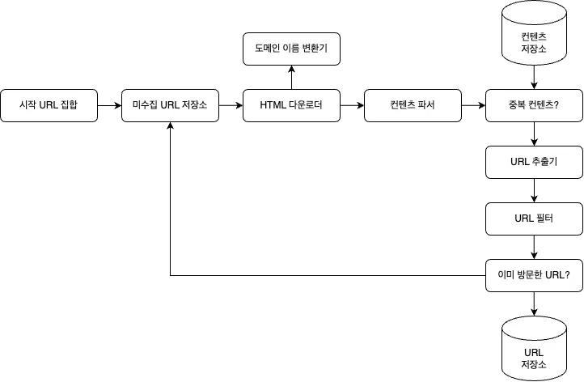

# 📒 9장 - 웹 크롤러 설계

## ✅ 크롤러 사용 용도

- 검색 엔진 인덱싱
- 웹 아카이빙
- 웹 마이닝
- 웹 모니터링

## ✅ 1단계 - 문제 이해 및 설계 범위 확정

### 절차
1. url 집합이 주어지면 해당 url들이 가리키는 모든 웹 페이지 다운로드
2. 다운받은 웹페이지에서 url들을 추출
3. 추출된 url들을 다운로드할 url 목록에 추가하고 위 과정 반복

~~~
1. 검색 인덱스 용 크롤러를 설계
2. 매달 10억 개의 웹 페이지를 수집
3. 새로 만들어진 웹이나 수정된 웹도 고려
4. 수집한 웹은 5년간 저장
5. 중복된 컨텐츠는 무시
~~~

### 주의해야할 속성
- 규모 확장성
- 안정성(robustness)
- 예절(politeness)
- 확장성(extensibility)

## ✅ 개략적 설계안 제시 및 동의 구하기

### 시작 URL 집합 
- 웹 크롤러가 크롤링을 시작하는 출발점
- 전체 웹을 크롤링해야하는 경우에는 크롤러가 가능한 한 많은 링크를 탐색할 수 있도록 하는 URL을 고르는 것이 바람직
- 일반적으로 전체 URL 공간을 작은 부분집합으로 나누거나 주제별로 다른 URL을 사용하는 전략을 사용

### 미수집 URL 저장소
- 크롤링 상태는 다운로드할 URL, 다운로드된 URL의 두 가지로 나눠 관리
- 미수집 URL 저장소는 다운로드할 URL을 관리하는 컴포넌트이고, FIFO 큐로 구현

### HTML 다운로더
- 인터넷에서 웹 페이지를 다운로드하는 컴포넌트

### 도메인 이름 변환기
- 웹 페이지를 다운받으려면 URL을 IP 주소로 변환하는 절차가 필요

### 콘텐츠 파서
- 웹페이지를 다운로드하면 저장 공간 낭비를 방지하기 위해 파싱과 검증 절차를 거쳐야 함

### 중복 컨텐츠 검증
- 웹 페이지의 해시 값을 비교하여 데이터 중복을 줄이고 데이터 처리에 소요되는 시간을 줄임

### 콘텐츠 저장소
- 콘텐츠 저장소는 HTML 문서를 보관하는 시스템

-> 저장소를 구현하기 위해 데이터 유형, 크기, 저장소 접근 빈도, 데이터의 유효 기간 등을 종합적으로 고려

### URL 추출기
- URL 추출기는 HTML 페이지를 파싱하여 링크를 골라내는 역할

### URL 필터
- URL 필터는 특정한 콘텐츠 타입이나 파일 확장자를 갖는 URL, 접속 시 오류가 발생하는 URL, 접근 제외 목록에 포함된 URL 등을 크롤링 대상에서 배제하는 역할

### 이미 방문한 URL
- 이미 방문한 URL이나 미수집 URL 저장소에 보관된 URL을 추적할 수 있도록 하는 자료 구조(블룸 필터, 해시 테이블) 사용

### URL 저장소
- URL 저장소는 이미 방문한 URL을 보관하는 저장소

### 웹 크롤러 작업 흐름

 
1. 시작 URL을 미수집 URL 저장소에 저장
2. HTML 다운로더는 미수집 URL 저장소에서 URL 목록을 가져옴
3. HTML 다운로더는 도메인 이름 변환기를 사용하여 URL의 IP 주소를 알아내고, 접속하여 다운받음
4. 콘텐츠 파서는 다운된 HTML 페이지를 파싱하여 올바른 형식을 갖춘 페이지 검증
5. 콘텐츠 파싱과 검증이 끝난후 중복 콘텐츠인지 확인
    - 이미 저장소에 있는 콘텐츠인 경우 처리하지않고 버림
    - 저장소에 없는 콘텐츠인 경우 저장소에 저장한 뒤 URL 추출기로 전달
6. URL 추출기는 해당 HTML페이지에서 링크를 골라내고 URL 필터로 전달
7. 남은 URL만 중복 URL 판별 단계로 전달
8. 이미 처리한 URL인지 확인
9. 저장소에 없는 URL은 URL 저장소와 미수집 URL 저장소에 저장

| 단계 | 확인 대상 | 목적 | 효과 |
| :---: | :---: | :---: | :---: |
| **5단계** | **콘텐츠(Content)** | 데이터 중복 저장 방지 | 저장 공간 절약, 데이터 품질 유지 |
| **7/8단계** | **URL(Link)** | 웹 페이지의 중복 방문 방지 | 크롤링 효율 극대화, 자원 낭비 방지 |

## ✅ 3단계 상세 설계
### DFS vs BFS

- 페이지: 노드
- 하이퍼링크: 엣지
-> 유향 그래프 탐색 과정

- DFS은 좋은 선택이 아닐 가능성 높음
-> 그래프 크기가 클 경우 어느 정도로 깊숙이 가게 될지 가늠하기 어렵기 때문에 DFS를 사용하지 않고 주로 BFS를 사용
- BFS: FIFO

### 문제점
- 한 페이지에서 나오는 링크 상당수는 같은 서버로 되돌아감
- 크롤러는 같은 호스트에 속한 많은 링크를 받기 위해 바빠지는데, 링크들을 병렬로 처리하게 되면 서버는 과부하로 죽어버림
-> 예의 없는 크롤러(impolite)

- 표준적 BFS 알고리즘은 URL 간에 우선순위를 두지 않음
- 모든 페이지가 같은 중요도를 갖지 않기 때문에 트래픽의 양, 업데이트 빈도 등 기준에 따라 차등적으로 구별하는 것이 맞을 것

### 미수집 URL 저장소
 URL 사이의 우선순위와 신선도를 구별하는 예의 있는 크롤러를 구현 가능

### 예의
- 웹 크롤러는 수집 대상 서버로 짧은 시간 안에 너무 많은 요청을 보내는 것을 삼가야 함
- 너무 많은 요청을 보내는 것은 무례한 일이며 때로는 DoS 공격으로 간주
- 위 내용을 만족하기 위해 웹 사이트의 호스트명과 다운로드를 수행하는 워커 스레드 사이의 관계를 유지해야함!

- 큐 라우터(queue router)
    - 같은 호스트에 속한 URL은 언제나 같은 큐로 가도록 보장하는 역할
- 매핑 테이블(mapping table)
    - 호스트 이름과 큐 사이의 관계를 보관하는 테이블
- FIFO 큐
    - 같은 호스트에 속한 URL은 언제나 같은 큐에 보관
- 큐 선택기(queue selector)
    - 큐들을 순회하면서 큐에서 URL을 꺼낸후 다운로드하도록 지정된 워커 스레드에 전달하는 역할
- 워커 스레드(worker thread)
    - 전달된 URL을 순차적으로 다운로드하며, 작업들 사이에 delay를 둘 수 있음

### 우선순위
유용성에 따라 URL의 우선순위를 나눌 때는 페이지 랭크, 트래픽 양, 갱신 빈도 등 다양한 척도를 사용할 수 있음

 
- 순위결정장치(prioritizer): URL 우선순위를 정하는 컴포넌트
- 큐에 URL을 저장하기 전에 prioritizer 를 거치도록 설계
- prioritizer
    - 입력받은 URL을 우선순위 계산
- queue
    - 우선순위별로 큐가 하나씩 할당됨
- queue selector
    - 임의 큐에서 처리할 URL을 꺼내는 역할, 순위가 높은 큐에서 더 자주 꺼내도록 프로그래밍되어 있음
- front queue
    - 우선순위 결정 과정을 처리
- back queue
    - 크롤러가 예의 바르게 동작하도록 보증

### 신선도
- 웹 페이지의 변경 이력 활용
- 우선순위를 활용하여, 중요 페이지 자주 재수집

### 미수집 URL 저장소를 위한 지속성 저장장치
- 대부분 URL은 디스크에 두지만 I/O 비용을 줄이기 위해 메모리 버퍼에 큐를 두는 것
- 버퍼에 있는 데이터는 디스크에 주기적으로 저장

### HTML 다운로더
- Robots.txt
    - 로봇 제외 프로토콜이라고 부르는 robots.txt는 웹 사이트가 크롤러와 소통하는 표준 방법
    - robots.txt 파일들은 거푸 다운로드하는 것을 피하기 위해, 이 파일은 주기적으로 다시 다운받아 캐시에 보관

 

### 성능 최적화

- 분산 크롤링
    - 성능을 높이기 위해 크롤링 작업을 여러 서버에 분산

- 도메인 이름 변환 결과 캐시
    - DNS 조회 결과로 얻어진 도메인 이름과 IP 주소 사이의 관계를 캐시에 보관하여 cron job 등을 돌려 주기적으로 갱신
- 지역성
    - 서버를 지역별로 분산
- 짧은 타임아웃
    - 응답이 느리거나 응답하지 않는 서버를 대비하기 위해 wait time 을 설정

### 안정성

- 안정 해시(consistent hashing)
    - 크롤링 서버을 분산할 때 적용
- 크롤링 상태 및 수집 데이터 저장
    - 서버 장애를 대비하여 수집된 데이터를 지속적으로 저장장치에 기록
- exception handling
- data validation

### 확장성
시스템은 항상 진화하기 때문에 새로운 형태의 콘텐츠를 쉽게 지원할 수 있도록 설계해야 함

 
### 문제 있는 콘텐츠 감지 및 회피

- 중복 컨텐츠
    - 해시나 체크섬을 사용하여 중복 콘텐츠 탐지
- 거미 덫(크롤러를 무한 루프에 빠지도록 설계한 웹 페이지)
    - URL 최대 길이를 제한 -> 완벽히 회피하기 어렵기 때문에 URL 필터 목록 활용
- 데이터 노이즈
    - 가치없는 데이터 제외

## ✅ 4단계 마무리

- 서버 측 렌더링
    - 많은 웹 사이트는 자바스크립트, AJAX 등의 기술을 사용해서 링크를 즉석으로 만들기 때문에 페이지를 파싱하기 전에 서버측 렌더링을 적용
- 원치 않는 페이지 필터링
    - 스팸성 걸러내기
- 데이터베이스 다중화 및 샤딩
- 수평적 규모 확장성
    - 무상태 서버 유지 중요
- 가용성,  일관성, 안정성
- 데이터 분석 솔루션
