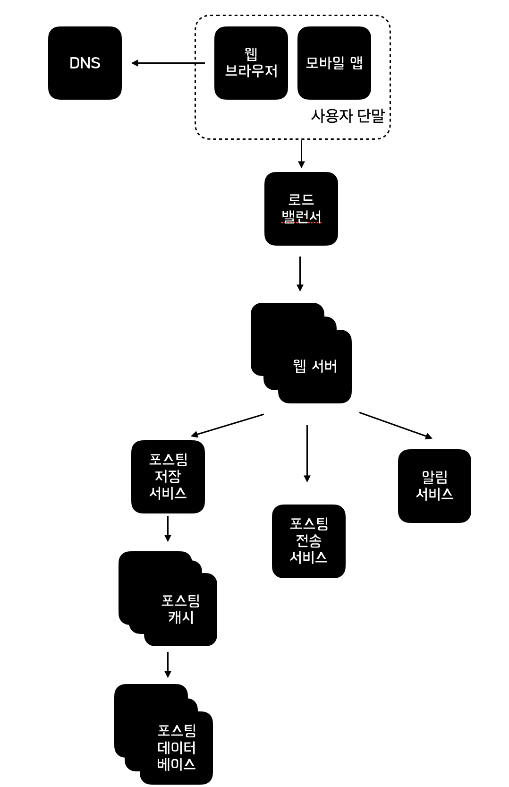
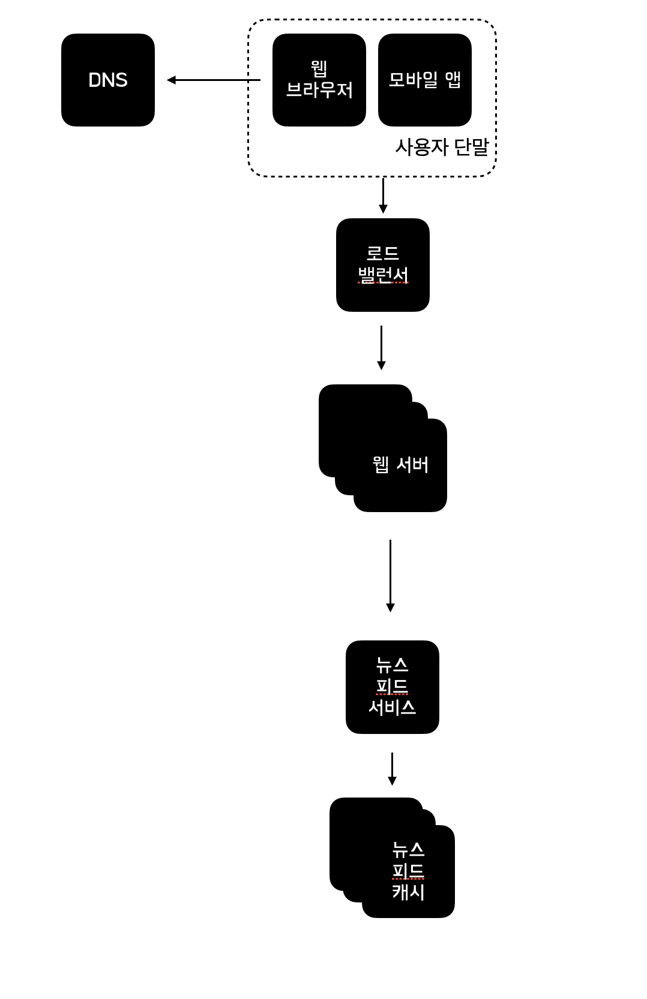

# 📒 11장 - 뉴스 피드 시스템 설계

## ✅ 1단계 문제 이해 및 설계 범위 확정

1. 모바일 앱, 웹 모두 지원
2. 사용자가 업로드한 스토리 및 친구들이 올리는 스토리를 볼 수 있어야 함
3. 피드는 최근 순으로 정렬
4. 사용자는 5천 명의 친구를 맺을 수 있음
5. 매일 천만명 방문
6. 피드는 이미지, 비디오 모두 포함

## ✅ 2단계 개략적 설계안 제시 및 동의 구하기 

1. 피드 발행 : 사용자가 스토리 포스팅하면 해당 데이터를 Cache와 DB에 기록, 새 포스팅은 친구의 뉴스피드에도 전송, post
    
2. 피드 생성 : 모든 친구의 포스팅을 최신순으로 모아서 생성, get

### 피드 발행

- 사용자: 
    - 모바일 앱이나 브라우저에서 새 포스팅을 올리는 주체다. POST /v1/me/feed API를 사용

- 로드밸런서(load balancer): 
    - 트래픽을 웹 서버들로 분산

- 웹 서버: 
    - HTTP 요청을 내부 서비스로 중계하는 역할을 담당

- 포스팅 저장 서비스(post service): 
    - 새 포스팅을 데이터베이스와 캐시에 저장

- 포스팅 전송 서비스(fanout service): 
    - 새 포스팅을 친구의 뉴스 피드에 푸시 
    - 뉴스 피드 데이터는 캐시에 보관하여 빠르게 읽어 갈 수 있도록 함

- 알림 서비스(notification service): 
    친구들에게 새 포스팅이 올라왔음을 알리거나, 푸시 알림을 보내는 역할을 담당

### 피드 생성

- 사용자: 
    -   뉴스 피드를 읽는 주체
    -  GET /v1/me/feed API를 이용

- 로드 밸런서: 
    - 트래픽을 웹 서버들로 분산하

- 웹 서버: 
    - 트래픽을 뉴스 피드 서비스로 보냄

- 뉴스 피드 서비스(news feed service): 
    - 캐시에서 뉴스 피드를 가져오는 서비스

-  뉴스 피드 캐시(news feed cache):
    - 뉴스 핃르르 렌더링할 때 필요한 피드 ID를 보관

## ✅ 3단계 상세 설계
### 웹서버
- 클라이언트와의 소통뿐만이 아니라 인증과 처리율도 담당
- 유해한 콘텐츠가 계속 자주 올라오는 것을 방지하기 위해서 특정 기간 동안 한 사용자가 올릴수 있는 포스팅의 수에 제한을 두어야함

### 포스팅 전송(fanout) 서비스
- 팬아웃(fanout)은 어떤 사용자의 새 포스팅을 그 사용자와 친구 관계에 있는 모든 사용자에게 전달하는 과정

### 쓰기 시점에 팬아웃하는 모델(푸시 모델)
- 새로운 포스팅을 기록하는 시점에 뉴스 피드를 갱신
- 포스팅이 완료되면 바로 해당 사용자의 캐시에 해당 포스팅을 기록하는 것

### 읽기 시점에 팬아웃하는 모델(풀 모델)

## 뉴스 피드 팬아웃 모델 비교

| 구분 | 쓰기 시점에 팬 아웃 하는 모델 | 읽기 시점에 팬아웃하는 모델 |
|---|---|---|
| 개념 | 새로운 포스팅을 기록하는 시점에 뉴스 피드를 갱신하는 모델 | 피드를 읽어야 하는 시점에 뉴스 피드를 갱신하는 모델 |
| 동작 방식 | 포스팅이 완료되면 바로 해당 사용자의 캐시에 해당 포스팅을 기록 | 사용자가 본인 홈페이지나 타임라인을 로딩하는 시점에 새로운 포스트를 가져옴 |
| 장점 | 뉴스 피드가 실시간으로 갱신되며 친구 목록에 있는 사용자에게 즉시 전송되고, 포스팅이 기록되는 순간 뉴스 피드가 이미 갱신되어 뉴스 피드를 읽는 데 드는 시간이 짧아진다 | 비활성화된 사용자 또는 서비스에 거의 로그인하지 않는 사용자에게 유리하며, 로그인하기 전까지는 어떤 컴퓨팅 자원도 소모하지 않고, 데이터를 친구 각각에 푸시하는 작업이 필요 없어 핫키 문제가 생기지 않는다 |
| 단점 | 친구가 많은 사용자의 경우 친구 목록을 가져오고 그 목록에 있는 사용자 모두의 뉴스 피드를 갱신하는 데 많은 시간이 소요될 수 있는 핫키 문제가 발생하며, 서비스를 자주 이용하지 않는 사용자의 피드까지 갱신해야 하므로 컴퓨팅 자원이 낭비된다 | 뉴스 피드를 읽는 데 많은 시간이 소요될 수 있다 |

- 본 설계안은 **쓰기 시점 팬아웃(푸시 모델)**과 **읽기 시점 팬아웃(풀 모델)**을 결합한 하이브리드 전략을 사용
- 뉴스 피드를 빠르게 가져오는 것이 중요하므로 **대부분의 사용자에게는 푸시 모델**을 적용
- 친구나 팔로어 수가 매우 많은 사용자의 경우, **필요할 때 포스팅을 가져오는 풀 모델**을 적용하여 시스템 과부하를 방지
- **안정 해시(Consistent Hashing)**를 적용하여 요청과 데이터를 보다 고르게 분산
-> **핫키(hot key) 문제를 완화**하는 것을 목표!!

## 팬아웃 서비스 동작 과정

팬아웃 서비스는 다음과 같은 단계로 동작함

1. 친구 ID 목록 조회
- 그래프 데이터베이스에서 친구 ID 목록을 가져옴
- 그래프 데이터베이스는 친구 관계나 친구 추천을 관리하기에 적합함

2. 사용자 정보 필터링
- 사용자 정보 캐시에서 친구들의 정보를 가져옴
- 사용자 설정에 따라 일부 친구를 걸러냄
  - 특정 친구의 피드 업데이트를 무시(mute)하도록 설정한 경우 해당 사용자의 새 스토리는 뉴스 피드에 노출되지 않음
  - 새로 포스팅된 스토리가 일부 사용자에게만 공유되도록 설정된 경우에도 동일하게 처리됨

3. 메시지 큐 적재
- 필터링된 친구 목록과 새 스토리의 포스팅 ID를 메시지 큐에 넣음

4. 뉴스 피드 캐시 갱신
- 팬아웃 작업 서버가 메시지 큐에서 데이터를 꺼냄
- 뉴스 피드 데이터를 뉴스 피드 캐시에 저장함

## 뉴스 피드 캐시 설계

- 뉴스 피드 캐시는 `<포스팅 ID, 사용자 ID>` 순서쌍을 보관하는 매핑 테이블로 볼 수 있음
- 새로운 포스팅이 생성될 때마다 이 캐시에 레코드가 추가됨
- 사용자 정보와 포스팅 정보 전체를 저장하지 않고 ID만 저장함
- 전체 데이터를 저장할 경우 메모리 요구량이 지나치게 증가할 수 있기 때문임
- 메모리 크기를 적정 수준으로 유지하기 위해 캐시 크기에 제한을 두며 해당 값은 조정 가능하도록 설계함

## 캐시 설계 근거

- 사용자가 뉴스 피드에 올라온 수천 개의 스토리를 모두 확인할 가능성은 매우 낮음
- 대부분의 사용자는 최신 스토리를 확인함
- 따라서 캐시 미스가 발생할 확률은 낮음

## 피드 읽기 흐름 상세 설계

이미지나 비디오와 같은 미디어 콘텐츠는 CDN에 저장하여 빨리 읽어 갈 수 있도록 하였음  
클라이언트가 뉴스 피드를 읽어 가는 과정은 다음과 같음

### 뉴스 피드 읽기 단계
1. 사용자가 뉴스 피드를 읽으려는 요청을 보냄  
2. 요청은 /v1/me/feed로 전송됨  
3. 로드밸런서가 요청을 웹 서버 가운데 하나로 보냄  
4. 웹 서버는 피드를 가져오기 위해 뉴스 피드 서비스를 호출함  
5. 뉴스 피드 서비스는 뉴스 피드 캐시에서 포스팅 ID 목록을 가져옴  
6. 뉴스 피드에 표시할 사용자 이름, 사용자 사진, 포스팅 콘텐츠, 이미지 등을 사용자 캐시와 포스팅 캐시에서 가져와 완전한 뉴스 피드를 만듦  
7. 생성된 뉴스 피드를 JSON 형태로 클라이언트에게 보냄  
8. 클라이언트는 해당 피드를 렌더링함  

## 캐시 구조

캐시는 뉴스 피드 시스템의 핵심 컴포넌트이며 본 설계안에서는 캐시를 다섯 계층으로 나눔

- 뉴스 피드 캐시는 뉴스의 피드 ID를 보관함  
- 콘텐츠 캐시는 포스팅 데이터를 보관하며 인기 콘텐츠는 따로 보관함  
- 소셜 그래프 캐시는 사용자 간 관계 정보를 보관함  
- 행동(action) 캐시는 포스팅에 대한 사용자의 행위 정보를 보관하며 "좋아요", 답글 등이 이에 해당함  
- 횟수(counter) 캐시는 "좋아요" 횟수, 응답 수, 팔로어 수, 팔로잉 수 등의 정보를 보관함  

## ✅ 4단계 마무리

# 📒 12장 - 채팅 시스템 설계

## ✅ 1단계 문제 이해 및 설계 범위 확정
~~~
- 응답지연이 낮은 일대일 채팅 기능
- 최대 100명까지 참여할 수 있는 그룹 채팅 기능
- DAU 5천만명
- 사용자의 접속상태 표시 기능
- 다양한 단말 지원
- 하나의 계정으로 여러 단말에 동시 접속 지원
- 푸시 알림
- 영구 저장
~~~

## ✅ 2단계 개략적 설계안 제시 및 동의 구하기

### 채팅서비스가 가지고 있어야 하는 기능
- 클라이언트들로부터 메시지 수신
- 메시지 수신자(recipient) 결정 및 전달
- 수신자가 접속(online) 상태가 아닌 경우에는 접속할 떄까지 해당 메시지 보관

### 폴링
- 클라이언트가 주기적으로 서버에게 새 메세지가 있느냐고 물어보는 방법
- 폴링을 자주할수록 비용 상승

### 롱폴링
- 클라이언트는 새 메세지가 반환되거나 타임아웃 될 때까지 연결 유지
새 메세지를 받으면 기존 연결 종료
- 서버에 새로운 요청을 보내어 모든 절차 다시 시작

### 웹소켓
- 서버가 클라이언트에 비동기 메세지를 보낼 때 가장 널리 사용하는 기술
- 클라이언트가 HTTP로 연결 시작, 핸드셰이크 절차를 걸쳐 웹소켓 연결로 업그레이드됨
- 영구적인 양방향 연결

### 무상태 서비스
- 로그인, 회원가입, 프로필 변경 등 웹사이트 및 앱이 보편적으로 제공하는 기능들을 처리
- HTTP 기반의 전통적인 API 요청/응답 방식
- 로드 밸런서 뒤에 위치
- 시장에 완제품으로 나와 있어서 직접 구현하지 않고 구매하여 사용 가능
- e.g. 클라이언트가 접속할 채팅 서버의 DNS 호스트명을 클라이언트에게 알려주는 서비스 탐색 서비스

### 상태 유지 서비스
- 채팅 서비스가 이에 해당
(채팅 클라이언트가 서버와 지속적인 웹소켓 연결을 유지하고 있기 때문에
- 채팅 서버는 각 클라이언트의 연결 상태를 기억해야 함)
- 서비스 탐색 서비스와 협력하여 특정 서버에 부하가 몰리지 않도록 함

### 제3자 서비스 연동
- 푸시알림
- 새 메세지를 받았다면 앱이 실행 중이지 않더라도 알림을 받아야 함

### 규모 확장성
- 소규모일 때는 앞서 설명한 모든 기능들을 하나의 서버에서 구현 가능
- 이론상 동시접속자가 100만명이고 접속 당 10KB의 메모리를 사용한다고 가정하면, 10GB 메모리 만으로 모든 연결 처리 가능

-> 하지만 SPOF 등의 문제로 한 대의 서버에서 모든 트래픽을 처리하도록 설계하는 것은 좋지 않음, 규모 확장성을 고려해야 함

### 전체적인 설계
1. 클라이언트는 채팅 서버와 지속적인 웹소켓 연결을 유지
2. 채팅 서버는 클라이언트 사이에 메시지 전송과 수신을 중계
3. 접속 상태 서버는 사용자의 접속 여부 관리
4. API 서버는 로그인, 회원가입, 프로필 변경 등 나머지 전부를 처리
5. 알림 서버는 푸시 알림 전송
6. 키-값 저장소는 채팅 이력 보관, 사용자가 접속하면 이전 채팅 이력을 전부 조회 가능

### 저장소
- 데이터의 유형과 읽기/쓰기 연산의 패턴을 고려하여 어떤 DB를 사용할지 결정해야 함
- 채팅 시스템이 다루는 데이터:
1. 사용자 프로필, 설정, 친구 목록과 같이 일반적인 데이터 --> 관계형 DB에 저장
2. 채팅 이력과 같은 채팅 시스템에 고유한 데이터 --> 키-값 저장소:

- 채팅 이력 데이터는 양이 많음 (페이스북이나 왓츠앱은 매일 600억개 메세지 처리)
- 오래된 메세지보단 최근에 주고 받은 메세지를 빈번히 사용
- 검색이나 멘션 등을 통한 무작위 데이터 접근도 지원해야 함
- 1:1 채팅 앱의 경우 읽기:쓰기 비율은 약 1:1

- 키-값 저장소의 장점:
1. 수평적 규모확장이 쉬움
2. 데이터 접근 지연시간이 낮음
3. 관계형DB는 롱테일을 잘 처리하지 못하는 경향이 있으며, 인덱스가 커지면 데이터 무작위 접근 비용이 증가
5. 기존의 안정적인 채팅 시스템들이 키-값 저장를 채택하였음

### 데이터 모델

1. 1:1 채팅을 위한 메세지 테이블:
~~~
pk: message_id(메세지 순서를 정하는 역할도 함)
~~~

2. 그룹 채팅을 위한 메세지 테이블:
 ~~~
 pk: (channel_id, message_id) 복합 키
channel: 채팅 그룹, partition key로도 사용
~~~

3. 메세지 ID:
~~~
message_id 가 만족해야 할 속성:
고유해야 함
정렬 가능해야 하며, 시간 순과 일치해야 함
RDBMS는 auto_increment 사용 가능하나, NoSQL에는 보통 없음
-> 스노플레이크 같은 전역적 64-bit 순서 번호 생성기 사용
-> 지역적 순서 번호 생성기 사용 (같은 그룹 내에서만 ID 유일성 보장)
~~~

## ✅ 3단계 상세 설계

### 서비스 탐색
- 클라이언트에게 위치나 서버 용량 등의 기준을 바탕으로 가장 적합한 채팅 서버를 추천하는 역할
- 대표적인 오픈 소스 솔루션: 아파치 주키퍼
- 사용 가능한 모든 채팅 서버를 서비스 탐색에 등록시켜두고, 클라이언트가 접속을 시도하면 사전에 정한 기준에 따라 최적의 채팅 서버를 골라줌

### 주키퍼로 구현한 서비스 탐색 시스템 동작
1. 사용자 A가 앱에 로그인 시도
2. 로드 밸런서가 로그인 요청을 API 서버 중 하나에 전달
3. 백엔드가 사용자 인증 처리 후, 서비스 탐색 기능이 사용자 A에게 가장 적합한 채팅 서버를 찾음
4. 사용자 A는 채팅 서버 2와 웹소켓 연결 맺음

### 메세지 흐름

- 1:1 채팅 메세지 처리 흐름
사용자 A가 사용자 B에게 메세지를 보낸 경우 처리:
1. 사용자 A가 채팅 서버 1로 메시지를 전송
2. 채팅 서버 1은 ID 생성기로 메시지 ID 발급
3. 채팅 서버 1은 메시지를 메시지 동기화 큐로 전송
4. 메시지는 키-값 저장소에 저장
5. 
- (a) 사용자 B가 접속 중이라면, 사용자 B가 연결된 채팅 서버 2로 메세지 전송
- (b) 사용자 B가 접속 중이 아니면, 푸시 알림 서버로 푸시 알림 메세지 전송
6. 채팅 서버 2는 사용자 B에게 메시지를 전달
7. 사용자 B와 채팅 서버 2 사이에 있는 웹소켓 연결을 사용

### 여러 단말 사이의 메세지 동기화
- 사용자 A는 핸드폰과 노트북 두 개 단말 사용
- 사용자가 핸드폰으로 채팅 앱에 로그인하여 채팅 서버 1과 웹소켓 연결
- 사용자가 노트북도 로그인하여 채팅 서버 1과 웹소켓 연결
- 각 단말은 cur_max_message_id 변수를 통해 단말 별 가장 최신 메세지 ID를 추적

- 아래 조건을 만족하면 최신 메세지로 간주:
~~~
- 수신자 ID가 현재 로그인된 사용자 ID와 같음
- 키-값 저장소에 보관된 메시지이고, 메세지 ID가 cur_max_message_id보다 큼
- cur_max_message_id는 단말마다 별도로 유지 관리하면 되므로 키-값 저장소에서 새 메세지를 가져오는 동기화 작업에 용이함
~~~

### 소규모 그룹 채팅에서의 메세지 흐름
사용자 A가 사용자 A, B, C의 세 명이 속한 그룹 채팅에 메시지를 보냄 -> 이 메시지를 B, C의 메시지 동기화 큐(받은 편지함)에 복사하는 방식

- 소규모 그룹 채팅에 적합
- 대규모 그룹에서는 모든 구성원에게 메시지를 복사하는 방식이 비효율적

### 접속 상태 표시

- 접속상태 서버는 클라이언트와 웹소켓으로 통신하는 실시간 서비스의 일부

### 로그인
1. 로그인 흐름은 '서비스 탐색' 절에서 설명된 것처럼 동작
2. 클라이언트와 실시간 서비스(채팅 서버) 간에 웹소켓 연결 형성
3. 접속 상태 서버는 사용자 A의 상태와 last_active_at 타임스탬프 값을 키-값 저장소에 보관
4. 사용자가 접속 중으로 표시됨

### 로그아웃
- 키-값 저장소의 사용자 상태가 오프라인으로 바뀜
- 사용자가 오프라인으로 표시됨

### 접속 장애
- 항상 안정적일 수 없음
- 박동 검사

### 상태 정보의 전송
- 사용자 A의 친구들이 A의 접속 상태 변화를 인지하는 방법:

1. 상태정보 서버는 발행-구독 모델을 사용
2. 각 친구관계마다 채널을 하나씩 둠
3. 사용자 A의 접속 상태가 변경되면 그 사실을 A-B, A-C, A-D 채널에 각각 작성
4. 이 채널들은 각각 사용자 B, C, D가 구독
5. 이러한 클라이언트와 서버 간의 통신은 웹소켓을 사용

소규모는 괜찮지만 크기가 크면 비용, 시간이 많이 쓰임